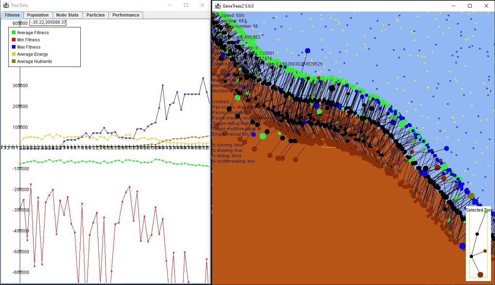
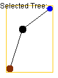

# GeneTrees-v2
GeneTrees-v2 is a toy that simulates artificial tree-like organisms and 
mutates them based on fitness, simulating evolution.

## Usage
- Install [Java](https://www.java.com/en/download/)
- Download [GeneTrees-v2 jar file](https://github.com/SimNine/GeneTrees-v2/releases/latest)
- Run GeneTrees-v2 jar file

## Controls
Main window:
 - Click and drag - pan view
 - P - Pause simulation
 - D - Toggle debug features
 - Q - Stop visual rendering (but keep simulating)
 - M - Toggle multithreading
 - T - Execute a single tick; only works if simulation is not currently running

Click on a tree to track it.
This displays additional information about it in the upper-left corner,
and displays the tree seperately in the lower-right corner.

The graph windows cannot be reopened once closed.
Graph window controls:
 - Click and drag - pan view
 - Scroll - scale vertical axis
 - CTRL+Scroll - scale horizontal axis

## Examples

Running for 300 generations:

